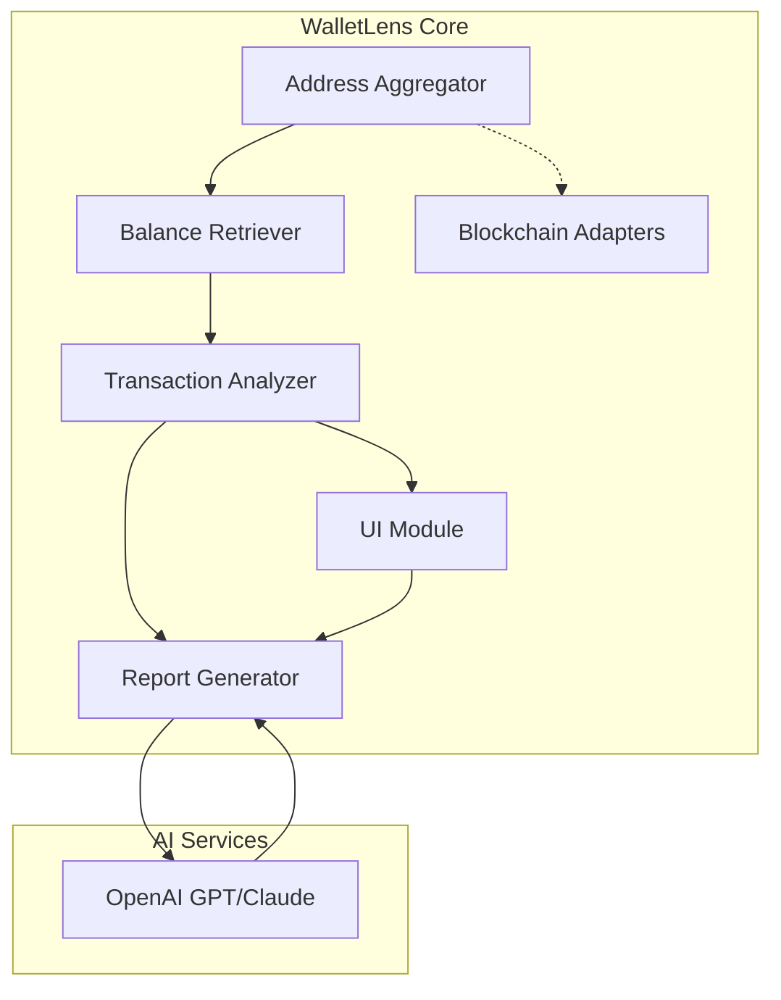

# 🚀 WalletLens: Universal Crypto Portfolio Analyzer

crypto-wallet-analyzer  
DESCRIPTION:  
🔎 Gain deeper visibility into your cryptocurrency portfolio with WalletLens—an extensible analytics and reporting toolkit for wallet address aggregation, real-time asset tracking, historical insights, and secure transaction visualization. Build insightful dashboards, automate notifications, and optimize your wallet strategy effortlessly.

  
**Download WalletLens 2026 Analytics Suite**  
*Click the badge above to start your journey in enlightened crypto portfolio management!*

---

## 🛠️ Table of Contents

- [About WalletLens](#about-walletlens)
- [Key Features](#key-features-)
- [Mermaid Architecture Diagram](#mermaid-architecture-diagram-)
- [Feature List](#feature-list-)
- [Example Profile Configuration](#example-profile-configuration-)
- [Console Invocation Example](#console-invocation-example-)
- [🌏 OS Compatibility Table](#-os-compatibility-table-)
- [API Power-Ups: OpenAI & Claude Integration](#api-power-ups-openai--claude-integration-)
- [Responsive User Interface & Multilingual Support](#responsive-user-interface--multilingual-support-)
- [24/7 Customer Support](#247-customer-support-)
- [Disclaimer](#disclaimer-)
- [License](#license-)
- [Download Again](#download-again-)

---

## 📡 About WalletLens

*WalletLens* is a next-generation crypto portfolio analyzer that spotlights every corner of your digital holdings. Imagine it as the telescope for your blockchain universe: aggregate addresses, visualize multisig behavior, summon historical balance charts, harness predictive AI insights, and export clean, tax-ready reports—all from an extensible, modular codebase.

With WalletLens, your scattered tokens across multiple blockchains and addresses are transformed into a unified lens for deep analysis and strategy. It's as if your crypto holdings just received their own personal financial advisor, data scientist, and world-class dashboard, all collaborating to help you optimize and diversify.

---

## 🦄 Key Features 🪙

- **Unified Analytics Engine**: Aggregate thousands of cryptocurrency addresses and tokens (BTC, ETH, SOL, ADA, and more).
- **Real-Time Portfolio Tracking**: Fetch live market, balance, and token information.
- **Historical Insights**: Chart portfolio changes, transaction activity, and address behaviors over any timeframe.
- **Universal Blockchain Support**: Modular adapters for dozens of leading blockchains.
- **AI-Powered Insights**: Leverage OpenAI and Claude AI for portfolio optimization tips, anomaly detection, and simulated risk analysis.
- **Automated Alerts & Reports**: Schedule periodic reports and price threshold notifications.
- **Intuitive Responsive UI**: Web and CLI with mobile-friendly dashboards and exportable formats.
- **Multilingual Magic**: Seamlessly switch between English, Spanish, Chinese, French, and more.
- **Extensible Plugin System**: Add custom analytics or integrate with your own backend.
- **Sovereign Security**: Encrypt sensitive data with your custom keys and run everything locally if desired.
- **24/7 Human & AI Support**: Access global support, night or day.

---

## 🎨 Mermaid Architecture Diagram

---

## 🧩 Feature List 

**WalletLens 2026 Offers:**

- 📊 **Comprehensive Analytics:** Track multi-chain balances, transactions, Dapp interactions, and DeFi positions.
- 🗂️ **Aggregated Portfolio View:** Group multiple wallets into 'profiles' for consolidated analysis.
- 🧠 **AI-Enhanced Advisory:** Get personalized AI insights for portfolio optimization and risk signals.
- 📅 **Scheduled Reporting:** Automate CSV, PDF, or JSON reports—ideal for taxes and compliance.
- 🚨 **Smart Alerts:** Get notified on major dips, gains, or custom event triggers.
- 📱 **Device-Agnostic UI:** Use WalletLens on desktop, tablet, or phone with full feature parity.
- 🌍 **Localization:** Out-of-the-box language packs with community-driven updates.
- 🔒 **Privacy-First:** Non-custodial. No keys, no coins—you retain total control.

---

## 📝 Example Profile Configuration

Here’s a sample configuration file (`lens-profile.yaml`) that demonstrates how easy it is to get started.

yaml
profile:
  name: "My Diversified Portfolio 2026"
  wallets:
    - blockchain: bitcoin
      address: "1A1zP1eP5QGefi2DMPTfTL5SLmv7DivfNa"
    - blockchain: ethereum
      address: "0xde0B295669a9FD93d5F28D9Ec85E40f4cb697BAe"
    - blockchain: solana
      address: "4k3Dyjzvzp8eFmyqQy4e1gSNqnv7eF5zcdntFcsbh4Xy"
  notifications:
    price_change_threshold: 5  # percent
    preferred_language: "en"
ai_assistant:
  enabled: true
  provider: "openai"

---

## 💻 Console Invocation Example

Easily invoke terminal analytics, for scripting or power use:

shell
walletlens analyze --config lens-profile.yaml --output report-2026.pdf --lang fr --ai-helper true

*This command analyzes configured wallets, generates a PDF report in French, and includes AI-driven explanations.*

---

## 🌏 OS Compatibility Table

| OS            | Status     | Emoji   | Notes                           |
|---------------|------------|---------|---------------------------------|
| Windows 10/11 | ✅ Ready   | 🪟    | Full feature parity             |
| macOS 14+     | ✅ Ready   | 🍏    | Checked on Apple Silicon        |
| Ubuntu 22+    | ✅ Ready   | 🐧    | Extensive Linux support         |
| Fedora 40+    | ✅ Ready   | 🦦    | Supported via Snap & Flatpak    |
| iOS/iPadOS    | ✅ Ready   | 📱    | Mobile PWA and browser support  |
| Android 14+   | ✅ Ready   | 🤖    | Responsive web/mobile UI        |

---

## 🤯 API Power-Ups: OpenAI & Claude Integration

- Ask questions to your wallet AI (e.g., "How much SOL did I receive in Q2 2026?")
- Summon tips for rebalancing to minimize gas fees with OpenAI
- Detect irregular withdrawals or deposits with Claude
- Immediate access to AI support in every language—no need to browse docs

Integration is as simple as pasting your secure API key in `lens-profile.yaml`.

---

## 📱 Responsive User Interface & Multilingual Support

With WalletLens, your data adapts to you, not the other way around. Enjoy dazzling dashboards on any screen—wide or small, day or night. Switch languages with a tap. Community-driven translation means support for 17+ languages by 2026.

---

## 🕒 24/7 Customer Support

Lost on your wallet journey? Real humans and swift AI assistants are on standby—every hour, every timezone, so you’re never alone in the cryptoverse.

---

## ⚠️ Disclaimer

WalletLens is an analytical tool for personal wallet data aggregation and analysis. It does not provide financial, investment, or legal advice. All portfolio assessments, AI suggestions, and analytical results are informational only. Please use at your own discretion and read the full EULA included with the software.

---

## 📄 License

MIT License – 2026  
Read the [full license here](LICENSE).

---

  
**Download the latest WalletLens build to illuminate your crypto journey!**